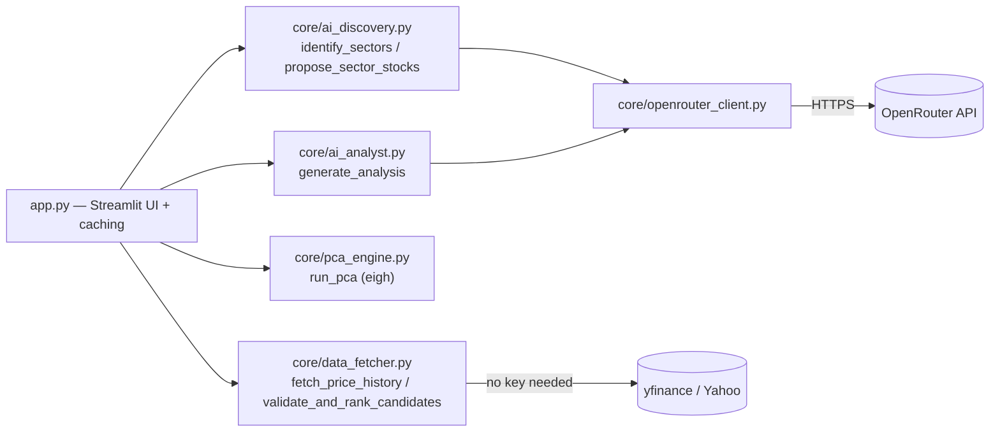
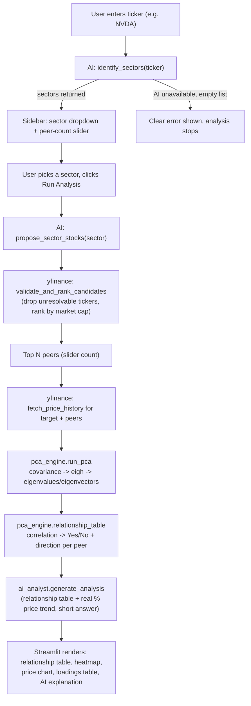

# Sector Eigen-Correlation Explorer

Pick a stock → an AI layer figures out which sectors/themes it belongs to
→ AI proposes peer stocks in that sector, validated and ranked by live
market cap → recent price history is pulled for the group → PCA /
eigen-decomposition runs on daily returns → the app answers one direct
question: **if this stock moves, does the rest of the group move with
it — yes or no, and which way?**

## How it works

1. **Sector discovery** (`core/ai_discovery.py`) — given a ticker, an LLM
   (via OpenRouter) returns every sector/theme it plausibly belongs to,
   open-ended rather than picked from a fixed list (e.g. NVDA comes back
   as `["Semiconductors", "AI Infrastructure", "Data Center Hardware",
   "Graphics Processing Units"]`). The sidebar shows these as a dropdown —
   pick which one to analyze against.
2. **Peer discovery** (`core/ai_discovery.py` + `core/data_fetcher.py`) —
   for the chosen sector, the LLM proposes up to 20 candidate tickers.
   Every candidate is checked against yfinance: no market cap means the
   ticker doesn't actually resolve, so it's dropped. Survivors are ranked
   by live market cap; a sidebar slider picks how many of the top-ranked
   ones to actually compare against (default 10).
3. **Price + market cap fetch** (`core/data_fetcher.py`) — yfinance, no
   key required, results cached (`st.cache_data`) to cut repeat calls.
4. **PCA / eigen-decomposition** (`core/pca_engine.py`) — daily returns
   are centered and their covariance matrix eigen-decomposed via `eigh`
   (numerically correct for symmetric matrices — the original notebook
   used plain `eig`, which is the wrong tool here and can return spurious
   tiny imaginary components).
5. **Relationship call** (`core/pca_engine.py::relationship_table`) — for
   every peer, its correlation with the target ticker is turned into a
   direct, deterministic Yes/No: `|correlation| >= 0.5` means "yes, real
   relationship" (direction from the sign); below that, "no reliable
   relationship." No AI involved in this step — it's the actual data,
   not a summary of it.
6. **AI explanation** (`core/ai_analyst.py`) — the relationship table
   (which tickers move with the target, against it, or not at all),
   plus each ticker's real % price change over the fetch window, are
   sent to an LLM for a short (≤80 word) plain-English answer to "if
   this stock moves, what happens to the rest" — no analyst jargon, no
   dispersion/bellwether framing, no compliance boilerplate, just the
   direct answer grounded in the table above it. If the key is missing
   or the call fails, the relationship table is unaffected — this layer
   degrades gracefully rather than crashing the app, same as sector/peer
   discovery.

Both AI call sites go through one shared client, `core/openrouter_client.py`,
so there's exactly one place that talks to OpenRouter.

## Architecture



## Request flow (one "Run Analysis" click)



## Setup (VS Code / local)

```bash
# 1. Clone / open this folder in VS Code
# 2. Create a virtual environment
python3 -m venv venv
source venv/bin/activate        # Windows: venv\Scripts\activate

# 3. Install dependencies
pip install -r requirements.txt

# 4. Set up your API key
cp .env.example .env
# open .env and paste your real OpenRouter key (get one free at openrouter.ai)

# 5. Run it
streamlit run app.py
```

Streamlit opens automatically at **http://localhost:8501**. Without an
`OPENROUTER_API_KEY`, sector/peer discovery and the AI writeup can't run —
the app shows a clear error instead of crashing, but a key is required to
actually use it, since there's no offline data source behind it.

## Deploying (free)

[Streamlit Community Cloud](https://streamlit.io/cloud) is the best free
fit for this app specifically because it runs as a persistent process —
no serverless execution-time limit to fight, unlike e.g. Vercel's free
tier (10s Python function timeout), which this pipeline's AI + yfinance
calls would routinely exceed.

1. Push this repo to GitHub (`.env` is gitignored — never committed).
2. On [share.streamlit.io](https://share.streamlit.io), connect the repo
   and point it at `app.py`.
3. In the app's **Settings → Secrets**, add:
   ```toml
   OPENROUTER_API_KEY = "your_real_key_here"
   ```
   Never put the real key in `.env.example` or anywhere in the repo —
   Streamlit Cloud secrets are the only place it should live in
   production.

## Extending it

- **Swap the AI model**: change `MODEL` in `core/openrouter_client.py` to
  any OpenRouter-supported model string.
- **Change how many candidate peers the AI proposes**: adjust the
  `limit` argument passed to `propose_sector_stocks` in `app.py`.
- **Change the default history window**: edit the `period` selectbox
  options in `app.py` (uses yfinance period strings: `1mo`, `3mo`, `6mo`,
  `1y`, `2y`, etc.).
- **Change cache lifetimes**: the `st.cache_data(ttl=...)` wrappers near
  the top of `app.py` — AI discovery is cached longer (rarely changes)
  than price/market-cap data (changes fast).

## Security note

The API key is loaded from a local `.env` file (gitignored) via
`python-dotenv` — never hardcoded in source. If you fork/push this to
GitHub, `.env` will not be included; only `.env.example` (with a blank
placeholder) is tracked. For a deployed instance, the key lives in
Streamlit Cloud's Secrets manager instead of any file in the repo.
